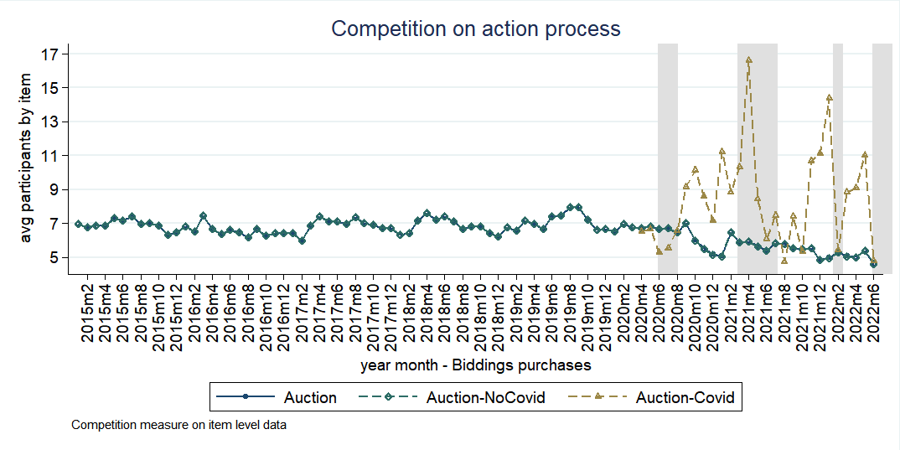

# 1: Overview
This repository has a selection of output options for R and STATA. Also, we can add methods that we want to use in other countries.

# 2: STATA

## 2.1 Graph pattern:  [./01-pattern_output/01-stata/01-Time trend graphs.do](https://github.com/dime-worldbank/emergency-response-procurement/tree/main/01-pattern_output/01-stata) 
This is a selection of good stata graphs settings.

